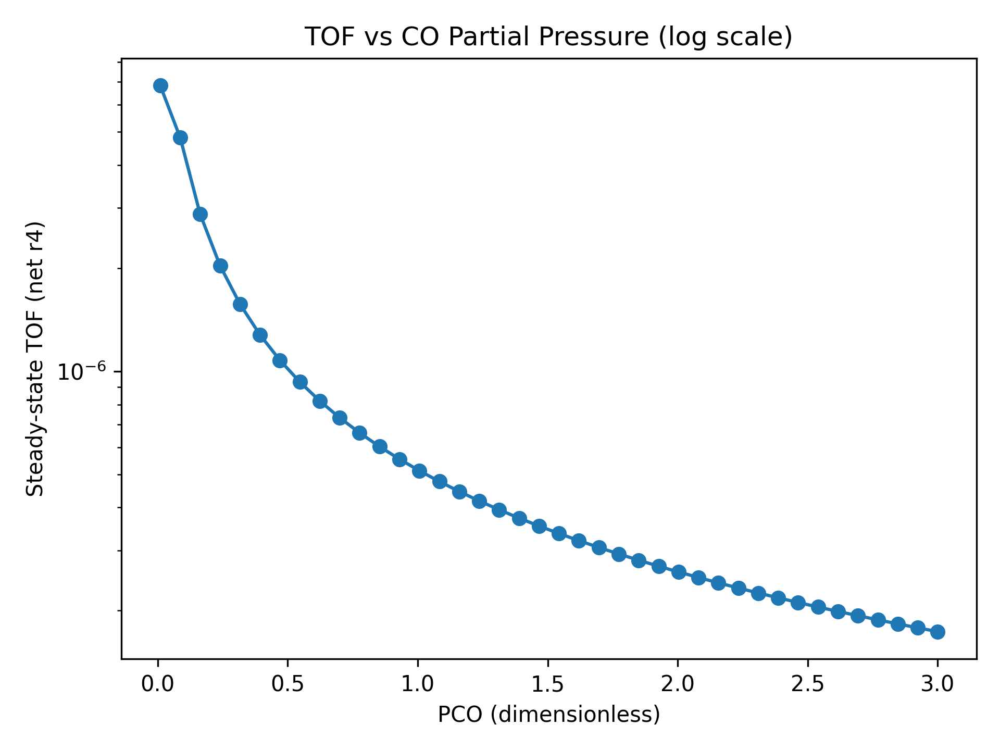
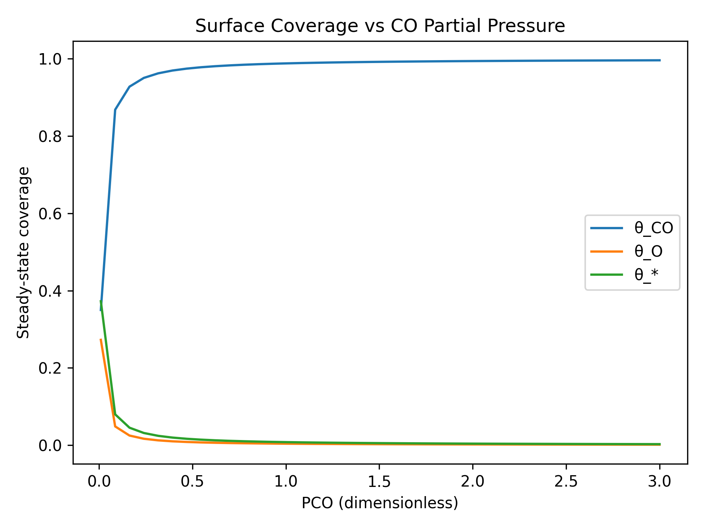
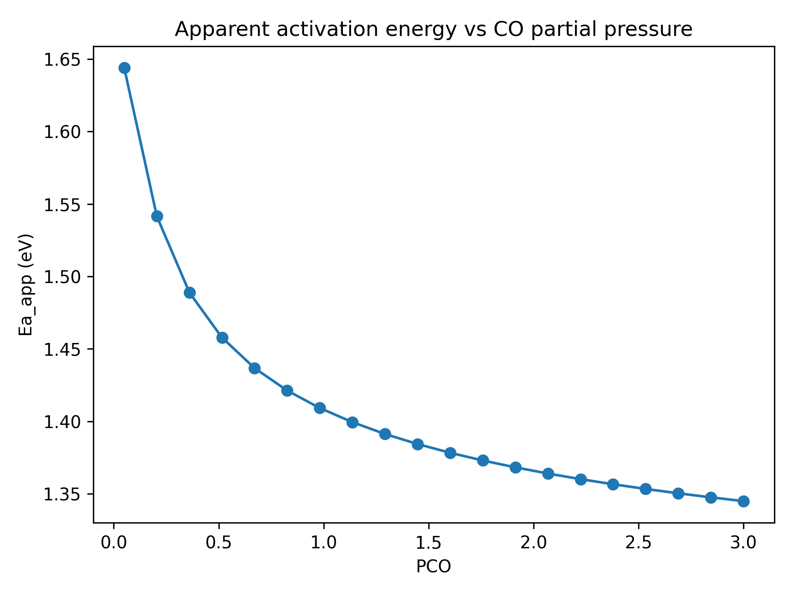
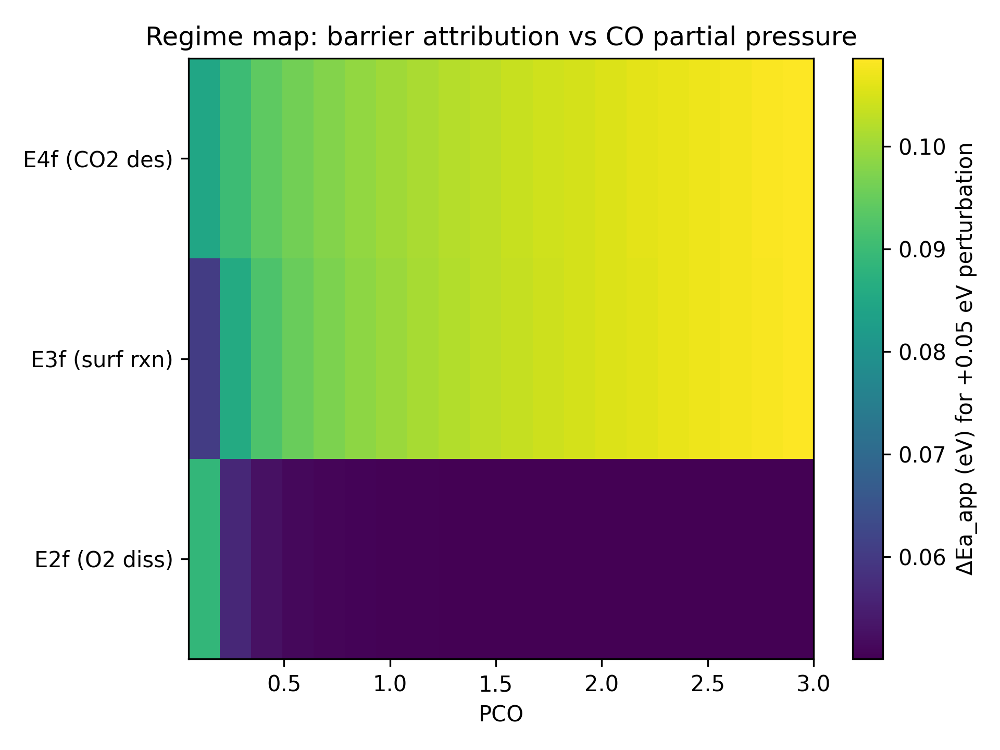

# CO Oxidation Microkinetic Modeling Framework

From Periodic DFT Energetics to Regime-Dependent Catalytic Performance

## Overview

This repository implements a physics-based microkinetic framework for heterogeneous CO oxidation on Pt(111).

The goal is to translate periodic DFT-derived adsorption energies and activation barriers into macroscopic catalytic behavior across temperature and gas-phase conditions.

The modeling pipeline connects microscopic energetics to system-level performance:

```bash
DFT Energetics
      ↓
Arrhenius Rate Constants
      ↓
Surface Coverage Dynamics
      ↓
Steady-State Flux
      ↓
Catalytic Performance Maps
```
The framework shows how surface competition, kinetic coupling, and operating conditions collectively determine catalytic activity.

## Reaction Network

The following elementary steps are modeled:

	1.	CO(g) + * ⇌ CO*
	2.	O₂(g) + 2* ⇌ 2O*
	3.	CO* + O* ⇌ CO₂*
	4.	CO₂* ⇌ CO₂(g) + *

where * denotes an empty surface site.

Surface site conservation is enforced:
```bash
θ_CO + θ_O + θ_CO₂ + θ_* = 1
```
Rate constants follow Arrhenius form:
```bash
k = A · exp(−Ea / (kB T))
```

## Mathematical Framework

The microkinetic model includes:

	• Mean-field surface kinetics
	• ODE-based surface coverage evolution
	• Numerical integration to steady state
	• Turnover frequency (TOF) defined as steady-state CO₂ formation rate

Temperature sweeps allow extraction of apparent activation energy from:
```bash
ln(TOF) vs 1/T
```

## Key Results

1. Regime-Dependent Catalytic Performance



Catalytic activity varies strongly with CO partial pressure.

Three regimes emerge:

	• Oxygen-activated regime (low CO)
	• Balanced regime (maximum activity)
	• CO-poisoned regime (high CO)

The volcano-like behavior arises from site competition and coverage redistribution, not from a single dominant barrier.

2. Surface Coverage Redistribution



Increasing CO pressure causes:

	• Increase in θ_CO
	• Decrease in empty sites θ_*
	• Suppression of O₂ adsorption

Catalytic performance therefore depends on surface availability, not only intrinsic rate constants.

3. Emergent Apparent Activation Energy



Apparent activation energy does not correspond to a single elementary barrier.

Instead it emerges from:

	• flux redistribution
	• coverage shifts
	• changing kinetic bottlenecks

4. Barrier Sensitivity and Regime Mapping



Barrier perturbation analysis identifies which step controls catalytic flux.

## Findings:

	• O₂ dissociation dominates in oxygen-rich regimes
	• Surface reaction becomes controlling near optimal activity
	• CO₂ desorption becomes important under CO-rich conditions

Rate control migrates across state space, demonstrating strong kinetic coupling.

## Technical Implementation

The framework is implemented in Python with a modular architecture.

Features include:

	• Arrhenius-based rate construction
	• Stiff ODE integration (BDF)
	• Temperature sweeps
	• CO pressure sweeps
	• Apparent activation energy extraction
	• Barrier perturbation analysis
	• Kinetic regime visualization

The structure is designed to integrate naturally with periodic DFT workflows.

## Model Assumptions

To maintain interpretability the model assumes:

	• Mean-field approximation
	• Single site type
	• No lateral adsorbate interactions
	• No coverage-dependent barriers
	• No transport limitations

These simplifications allow clear mechanistic interpretation while enabling systematic extensions.

## Reproducibility

Run baseline simulation:

```bash
python scripts/run_baseline.py
```

Parameter sweeps:
```bash
python scripts/sweep_pco.py
python scripts/sweep_T.py
python scripts/sweep_drc.py
python scripts/sweep_heatmap.py
```

## Core Insight

Catalytic performance is not determined by the largest intrinsic barrier.

Instead it emerges from:

	• which steps control net flux
	• how surface coverages redistribute
	• how operating conditions reshape kinetic bottlenecks

This framework demonstrates how electronic-structure energetics can be transformed into predictive catalytic behavior across operating regimes.
